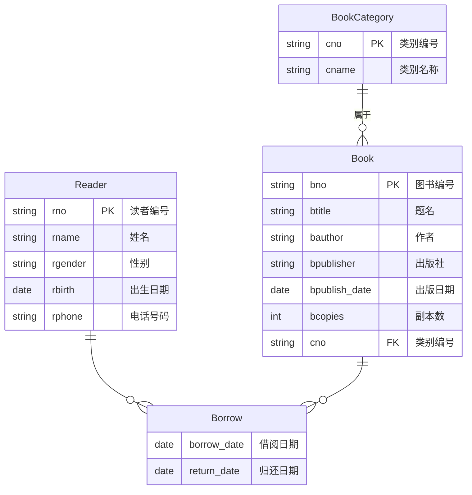
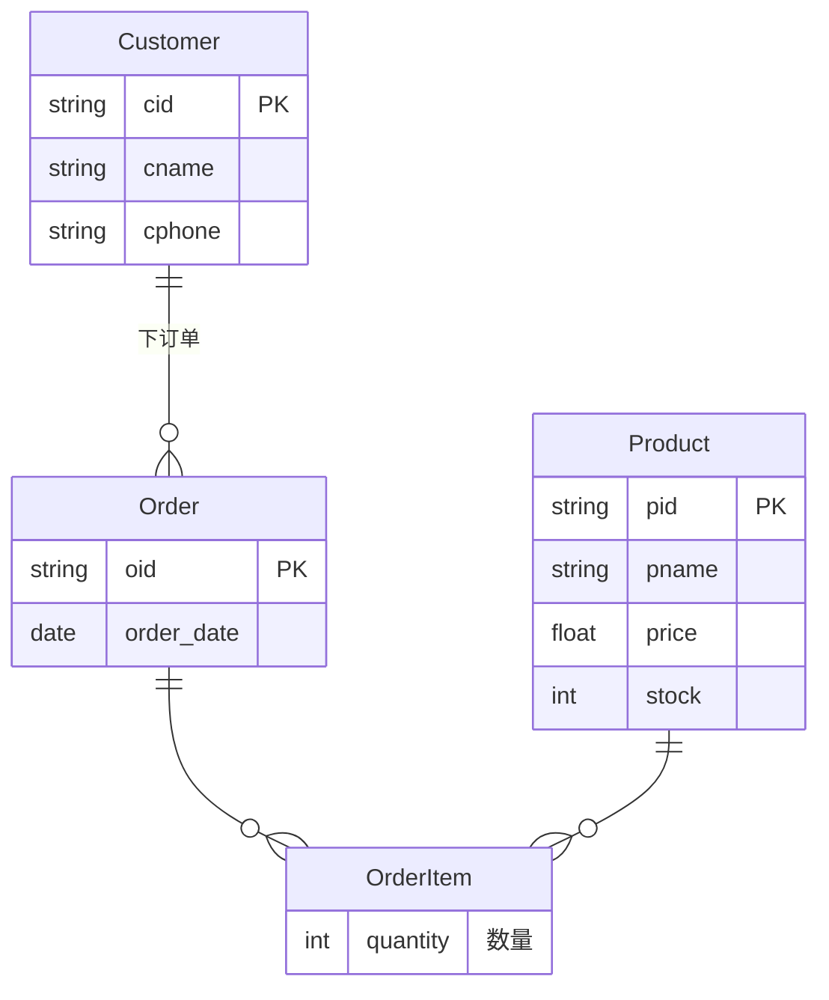

# 六、数据库设计（共 20 分）

## 20. 图书馆图书管理系统数据库设计

---

### 20.1 E/R 图（8 分）

使用 Mermaid ER 图表示如下：



**E/R 图文字描述：**

- **实体**：
  - **图书类别（BookCategory）**：属性有类别编号（cno，主键）、类别名称（cname）
  - **图书（Book）**：属性有图书编号（bno，主键）、题名（btitle）、作者（bauthor）、出版社（bpublisher）、出版日期（bpublish_date）、副本数（bcopies）
  - **读者（Reader）**：属性有读者编号（rno，主键）、姓名（rname）、性别（rgender）、出生日期（rbirth）、电话号码（rphone）

- **联系**：
  - **属于（BelongsTo）**：图书与图书类别之间为 **N:1** 联系（一种图书只属于一个类别，一个类别可包含多种图书）
  - **借阅（Borrow）**：读者与图书之间为 **M:N** 联系，联系属性有借阅日期（borrow_date）和归还日期（return_date）

---

> **考点讲解：E/R 图设计思路**
>
> **1. 如何识别实体？**
>
> 需求中出现的"名词"往往就是实体。本题中明显有三类"东西"需要管理——图书、图书类别、读者，所以它们就是三个实体。
>
> **2. 如何识别联系？**
>
> 看需求中的"动词"——"图书分为若干类别"→ 属于联系；"读者可以借阅多种图书""每种图书可以被多位读者借阅"→ 借阅联系。
>
> **3. 联系的基数（1:1 / 1:N / M:N）：**
>
> - 一种图书只属于一个类别，一个类别下有很多图书 → **N:1**（从图书看向类别）
> - 一个读者可以借多种书，一种书可以被多个读者借 → **M:N**
>
> **4. 联系属性的归属：**
>
> "借阅日期"和"归还日期"是借阅这个"动作"发生时产生的数据，既不属于读者也不属于图书，所以放在 Borrow 联系上。
>
> **5. 主键选取规则：**
>
> - 每个实体必须有一个能唯一标识它的属性（或属性组）作为主键
> - 对于 M:N 联系转换出的关系表，主键通常是两端实体主键的组合。Borrow 表的主键为 (bno, rno)，正好也满足"每位读者对每种图书只能借阅一个副本"的约束——因为 (bno, rno) 唯一，同一读者不能重复借同一种书

---

### 20.2 CREATE TABLE 语句（6 分）

```sql
-- 1. 图书类别表
CREATE TABLE BookCategory (
    cno   CHAR(10) PRIMARY KEY,
    cname VARCHAR(50) NOT NULL
);

-- 2. 图书表
CREATE TABLE Book (
    bno           CHAR(10) PRIMARY KEY,
    btitle        VARCHAR(100) NOT NULL,
    bauthor       VARCHAR(50),
    bpublisher    VARCHAR(50),
    bpublish_date DATE,
    bcopies       INT DEFAULT 1,
    cno           CHAR(10),
    FOREIGN KEY (cno) REFERENCES BookCategory(cno)
);

-- 3. 读者表
CREATE TABLE Reader (
    rno     CHAR(10) PRIMARY KEY,
    rname   VARCHAR(50) NOT NULL,
    rgender CHAR(2) CHECK (rgender IN ('男', '女')),
    rbirth  DATE,
    rphone  VARCHAR(20)
);

-- 4. 借阅表
CREATE TABLE Borrow (
    bno         CHAR(10),
    rno         CHAR(10),
    borrow_date DATE NOT NULL,
    return_date DATE,
    PRIMARY KEY (bno, rno),
    FOREIGN KEY (bno) REFERENCES Book(bno),
    FOREIGN KEY (rno) REFERENCES Reader(rno)
);
```

> **考点讲解**
>
> **1. 主键约束（PRIMARY KEY）：**
>
> 主键的作用是**唯一标识**表中的每一行。一个表只能有一个主键，主键的值不能为 NULL。设为主键的列会自动创建索引，查询更快。本题中每个实体表都设置了各自的主键（cno、bno、rno），借阅表的主键是组合主键 (bno, rno)。
>
> **2. 外键约束（FOREIGN KEY）：**
>
> 外键用于保证**引用完整性**——比如 Borrow 表中的 bno 必须是 Book 表中存在的图书编号，否则插入会失败。这防止了"借阅一本不存在的书"这种错误数据。可以打个比方：外键就像门禁系统，只有登记在册的人（主键表中存在）才能刷卡进入（插入到外键所在的表）。
>
> **3. CHECK 约束：**
>
> `CHECK (rgender IN ('男', '女'))` 限制了性别列只能填入这两个值。如果尝试插入 '未知' 或其他值，DBMS 会拒绝。这是一种**域完整性**约束，确保数据在列级别也是合法的。
>
> **4. 为什么 Borrow 表用 (bno, rno) 作主键？**
>
> 需求要求"每位读者对于每种图书只能借阅一个副本"。用 (bno, rno) 作为主键，天然保证同一个读者不能重复借同一种书。如果允许借多个副本，则需要在 Borrow 表中再增加一个区分副本的字段（如 copy_id），但本题需求明确只需一个副本，所以组合主键刚好满足。

---

### 20.3 创建视图与可更新性分析（6 分）

#### 创建视图

```sql
CREATE VIEW CurrentBorrow AS
SELECT r.rno        AS 读者编号,
       r.rname      AS 读者姓名,
       b.bno        AS 图书编号,
       b.btitle     AS 题名,
       br.borrow_date AS 借阅日期
FROM Reader r
JOIN Borrow br ON r.rno = br.rno
JOIN Book b ON br.bno = b.bno
WHERE br.return_date IS NULL;
```

#### 该视图是否可更新？

**答：该视图不可更新（not updatable）。**

> **原因分析：**
>
> 1. **涉及多表 JOIN**：该视图由 Reader、Borrow、Book 三张表通过 JOIN 连接而成。SQL 标准规定，视图如果是通过多张基表连接定义的，通常不允许直接进行 INSERT、UPDATE、DELETE 操作，因为 DBMS 无法确定修改应该映射到哪张基表上。
>
> 2. **包含 WHERE 条件**：WHERE br.return_date IS NULL 过滤出"当前正在借阅"的记录。如果对这个视图执行 INSERT，新插入的行没有 return_date 为 NULL 的自然语义映射，DBMS 不知道如何处理。
>
> 3. **如果强行更新会产生歧义**：例如想修改视图中某行的"题名"，这个修改应该反映到 Book 表的 btitle 列上，但 DBMS 不会自动推断这个映射关系。

> **考点讲解：可更新视图的条件**
>
> 一个视图要是可更新的，一般需要满足以下条件（简化版）：
>
> | 条件 | 说明 |
> |------|------|
> | 只涉及**单个基表** | 多表 JOIN 的视图一般不可更新 |
> | 没有 GROUP BY / HAVING | 聚合操作让行与基表的对应关系丢失 |
> | 没有 DISTINCT | DISTINCT 消除了重复行，无法确定对应哪条原始记录 |
> | SELECT 中包含主键列 | 没有主键，DBMS 无法定位要修改的具体行 |
> | 没有集合操作（UNION 等） | 集合操作来源不唯一 |
>
> 可以打一个比方：**单表视图就像一面普通的镜子**，你照镜子看到的是你自己，在镜子上画画（UPDATE）能对应到你脸上；**多表视图就像一面哈哈镜**，你看到的是经过变形（JOIN、过滤）后的样子，你在哈哈镜上做的修改无法对应回真实世界的任何一个人。

---

### 举一反三

#### 例题 1：ER 图设计

**题目**：请为某在线商城设计订单系统的数据库 E/R 图。需求如下：
- 顾客有属性：顾客编号、姓名、电话
- 商品有属性：商品编号、商品名、单价、库存量
- 一个顾客可以下多个订单，一个订单只属于一个顾客
- 一个订单可以包含多种商品，一种商品可以被多个订单包含
- 订单有属性：订单编号、下单日期
- 订单包含商品时需要记录购买数量

**答案**：



**简析**：顾客与订单是 1:N；订单与商品是 M:N，需拆出一个中间表 OrderItem，在中间表上放数量属性。

---

#### 例题 2：视图可更新性判断

**题目**：判断以下视图是否可更新，并简述理由。

```sql
CREATE VIEW MaleReader AS
SELECT rno, rname, rphone
FROM Reader
WHERE rgender = '男';
```

**答案**：**可更新**。它只涉及单张基表 Reader，SELECT 中包含主键 rno，WHERE 只是简单行过滤，没有聚合或 DISTINCT。对它执行 UPDATE/DELETE 可以直接映射到 Reader 表（INSERT 时新行的 rgender 会被自动设为 '男' 或需要补全，具体取决于 DBMS 实现）。

---

#### 例题 3：约束设计

**题目**：在 Borrow 表中，如何确保"归还日期不能早于借阅日期"？

**答案**：

```sql
ALTER TABLE Borrow
ADD CONSTRAINT chk_date CHECK (return_date IS NULL OR return_date >= borrow_date);
```

**简析**：CHECK 约束中的 `return_date IS NULL` 部分允许"尚未归还"的状态（归还日期为空），一旦填写归还日期，必须 ≥ 借阅日期。这是域完整性约束的一种扩展用法。
