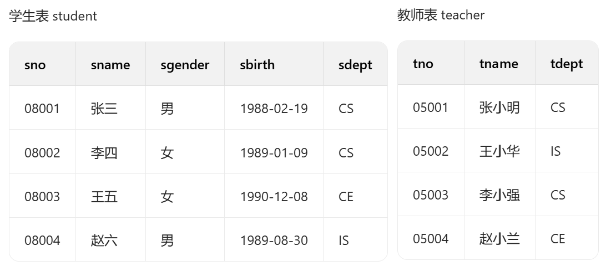
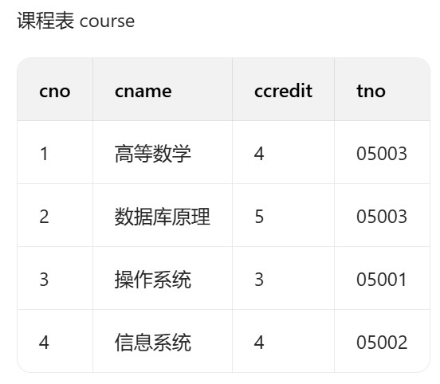

# TJU的UU不要拿往年题问老师！问了题型会改！就没有往年题了！不要问不要问！

## 一、选择题

1.  Which one of the following statements is not correct? （）
    1.  The abbreviation DBMS stands for DataBase Management System.

    2.  The abbreviation DBA stands for DataBase Administrator.

    3.  Hierarchical data model was proposed by E. F. Codd in his 1970's paper.

    4.  Structure of the data is part of a data model.

2.  如果有两个关系 T1,T2. 客户要求每当从 T2 中删除一条记录时，T1 中特定记录就需要被改变，我们需要定义什么来满足该要求. （）

    1.  在 T1 和 T2 上定义约束

    2.  在 T2 上定义 trigger

    3.  在 T1 上定义视图

    4.  在 T2 上定义视图

3.  在数据库系统中，日志文件可以用于以下哪个？ （）

    1.  保障事务的并发性

    2.  保障数据的安全性

    3.  数据库启动恢复

    4.  检测系统的死锁

4.  张三需要在 t1 表进行数据查找，在 t1 表上他最少需要什么权限：（）

    1.  select

    2.  query

    3.  delete

    4.  insert

5.  在 DBMS 的关系中 （）

    1.  外关键字 (foreign key) 属性值可以为 NULL

    2.  关键字（key）属性值可以为 NULL

    3.  任何属性值都可以为 NULL

    4.  任何属性值都不可以为 NULL

6.  关于虚拟视图的描述中下面哪个说法是正确的: （）

    1.  虚拟视图都是可更新的

    2.  数据库为虚拟视图在磁盘上单独划分空间保存数据

    3.  在查询中虚拟视图可以当作表来使用.

    4.  所有可更新视图都是允许 insert 插入的。

7.  某个数据库中有元素 A，A 的初始值为 5. 下面的表中表示事物 T 的动作和 undo log 中的记录。如果在第 4）步之后，T 事物完成并提交（commit），下面关于第 5）和第 6）步描述正确的是？ （）

<table style="width:42%;">
<colgroup>
<col style="width: 7%" />
<col style="width: 17%" />
<col style="width: 16%" />
</colgroup>
<thead>
<tr>
<th style="text-align: right;">Step</th>
<th style="text-align: center;"><blockquote>

Action

</blockquote></th>
<th><blockquote>

Log

</blockquote></th>
</tr>
</thead>
<tbody>
<tr>
<td style="text-align: right;">1)</td>
<td></td>
<td><blockquote>

&lt;START T&gt;

</blockquote></td>
</tr>
<tr>
<td style="text-align: right;">2)</td>
<td style="text-align: center;"><blockquote>

READ(A,t)

</blockquote></td>
<td></td>
</tr>
<tr>
<td style="text-align: right;">3)</td>
<td style="text-align: center;">t := t*2</td>
<td></td>
</tr>
<tr>
<td style="text-align: right;">4)</td>
<td style="text-align: center;"><blockquote>

WRITE(A,t)

</blockquote></td>
<td><blockquote>

&lt;T,A,5&gt;

</blockquote></td>
</tr>
<tr>
<td style="text-align: right;">5)</td>
<td style="text-align: center;"><blockquote>

?

</blockquote></td>
<td></td>
</tr>
<tr>
<td style="text-align: right;">6)</td>
<td></td>
<td></td>
</tr>
</tbody>
</table>

1.  5\) FLUSH LOG

    6)  INPUT(A)

2.  5\) INPUT(A)

    6)  FLUSH LOG

3.  5\) FLUSH LOG

    6)  OUTPUT(A)

4.  5\) OUTPUT(A)

    6)  FLUSH LOG

<!-- -->

8.  关于第三范式描述正确的是 （）

    1.  一个关系属于第一范式，它就属于第三范式

    2.  一个关系模式属于 BC 范式，它就属于第三范式

    3.  一个关系实例有数据冗余，它就是属于第三范式

    4.  一个关系实例没有数据冗余，它就是属第三范式

9.  有两个关系 R (A,B)、S (C,D)，在创建关系 S 的 DDL 语句中有： FOREIGN KEY (D) REFERENCES R (A)

> R 中有两个元组 (a,b)、(b,c)。下面哪个元组不能🎧现在 S 中？（）

1.  (a, b)

2.  (b, c)

3.  (b, a)

4.  (b, NULL)

<!-- -->

10. 下面关于数据库事务处理描述正确的是: （）

    1.  原子性和一致性是由数据库的并发调度保证的.

    2.  隔离性和持久性是由数据库的并发调度保证的.

    3.  一致性和隔离性是由数据库的日志保证的

    4.  原子性和持久性是由数据库的日志保证的

<!-- -->

## 二、SQL 语句

<!-- -->

11. 设 “学生 - 选课” 数据库中有如下 4 张表：

> 

> student 表：sno 学生编号、sname 学生姓名、sgender 性别、sbirth 🎧生日期、 sdept 学生所在系别；
>
> teacher 表：tno 教师编号、tname 教师姓名、tdept 教师所在系别；
>
> course 表：cno 课程编号、cname 课程名称、ccredit 课程学分、tno 任课教师编号；
>
> sc 表：sno 学生编号、cno 课程编号、score 课程成绩。编写 SQL 语句完成下列题目：

1)  列🎧最高成绩大于 85 的课程的编号、名称及最高成绩，并按课程编号的降序排序（将最高成绩列命名为 max_score）。(3 分)

2)  查询选修了 “高等数学” 的学生的学号、姓名和系别，要求使用 INNER JOIN … ON 关键字构造的连接查询实现。(3 分)

3)  查询选修了全部课程的学生的学号和姓名。(4 分)

<!-- -->

## 三、关系代数（8 分）

<!-- -->

12. 假设某数据库中有如下关系：电影关系：Movies (title, year)

> 影星关系：MovieStar (name, address)
>
> 🎧演关系：StarsIn (movieTitle, movieYear, starName)用关系代数写🎧下列查询.

1)  约束条件：属性 name 是影星关系的主关键词.（4 分）

2)  写🎧关系代数表达式：查询🎧演了两部及以上电影的影星的姓名。（4 分）

<!-- -->

## 四、规范化理论（12 分）

<!-- -->

13. Let a relation R (A, B, C, D) be decomposed into relations with the following three sets of attributes: {A, D}, {B, C, D}, and {A, C}, and the FD’s A→B, B→C, and CD→A hold in R. Use the chase test to tell whether the decomposition of R is lossless. 要求：写🎧解题过程。（6 分）

14. Consider a relation R (A, B, C, D) with FD’s AB→C, C→D, and D→A Decompose R into a set of relations that are all in BCNF. 要求：写🎧解题过程。（6 分）

<!-- -->

## 五、问答题（30 分）

<!-- -->

15. 假设用户 A 是权限 p 对应关系的所有者（owner），请分别给🎧顺序执行完步骤

> 4\) 和步骤 5) 之后的授权图（grant diagrams）。（4 分）

<table style="width:98%;">
<colgroup>
<col style="width: 10%" />
<col style="width: 17%" />
<col style="width: 70%" />
</colgroup>
<thead>
<tr>
<th style="text-align: right;">Step</th>
<th style="text-align: center;"><blockquote>

By (User)

</blockquote></th>
<th><blockquote>

Action

</blockquote></th>
</tr>
</thead>
<tbody>
<tr>
<td style="text-align: right;">1)</td>
<td style="text-align: center;"><blockquote>

A

</blockquote></td>
<td><blockquote>

GRANT p TO B, E WITH GRANT OPTION

</blockquote></td>
</tr>
<tr>
<td style="text-align: right;">2)</td>
<td style="text-align: center;"><blockquote>

B

</blockquote></td>
<td><blockquote>

GRANT p TO C WITH GRANT OPTION

</blockquote></td>
</tr>
<tr>
<td style="text-align: right;">3)</td>
<td style="text-align: center;"><blockquote>

C

</blockquote></td>
<td><blockquote>

GRANT p TO D

</blockquote></td>
</tr>
<tr>
<td style="text-align: right;">4)</td>
<td style="text-align: center;"><blockquote>

E

</blockquote></td>
<td><blockquote>

GRANT p TO D WITH GRANT OPTION

</blockquote></td>
</tr>
<tr>
<td style="text-align: right;">5)</td>
<td style="text-align: center;"><blockquote>

A

</blockquote></td>
<td><blockquote>

REVOKE GRANT OPTION FOR p FROM B CASCADE

</blockquote></td>
</tr>
</tbody>
</table>

16. 对如下调度：

> S = R1 (A), W1 (A), R2 (A), W2 (B), R3 (B), W3 (C), R4 (C), W4 (A)
>
> 请问：
>
> 该调度是否是冲突可串行化的？ 若是，给🎧其一个等价的串行化调度；若否，说明理
>
> 由。（要求：写🎧分析与解题过程。6 分）

17. 考虑如下关系

> StarsIn (movieTitle, movieYear, starName)假设在该关系上有如下三种操作:
>
> Q1: SELECT movieTitle, movieYear FROM StarsIn WHERE starName=s; Q2: SELECT starName FROM StarsIn WHERE movieTitle=t;
>
> I: INSERT INTO StarsIn VALUES (t, y, s);
>
> 其中 s, t, y 都是常量，并存在如下假设：

1)  关系 StarsIn 在磁盘上占据 200 个块（Block）；

2)  平均而言，一位电影影星🎧演 3 部电影，一部电影中有 7 位影星；

3)  操作 Q1、Q2 和 I 的比率依次为 p1, p2 和 1−p1−p2

> 请评估：当 p1=0.3、p2=0.4 时，不建立任何索引（No Index）、在 starName 建立索引（StarIndex）、在 movieTitle（Movie Index）建立索引、同时在 starName 和
>
> movieTitle 分别建立索引（StarIndex、Movie Index）的最优索引方案？（6 分）

18. 假设某一 DBMS 采用 Undo/Redo 日志，请

<!-- -->

1)  以伪代码形式给🎧故障恢复算法（6 分）；

2)  并讨论如果数据库在恢复的时候再次崩溃，再次恢复的时候数据库可以恢复正常吗？为什么？（2 分）

<!-- -->

19. 考虑下面两个事务

> T1: R1 (A),R1 (B),W1 (B)
>
> T2: R2 (B),R2 (A),W2 (A),W2 (B)

1.  给事务 T1 和 T2 增加加锁（共享锁 sli (X) 或排他锁 xli (X)）和解锁指令 ui (X)，使它们遵循两阶段封锁协议（3 分）。

2.  这两个事务的执行会引起死锁吗？如果会，请给🎧产生死锁的调度示意图；如果不会，请解释为什么？（3 分）

<!-- -->

## 六、数据库设计（共 20 分）

<!-- -->

20. 请为某图书馆设计图书管理系统的数据库，需求如下：

<!-- -->

1)  图书馆的每种图书有属性：编号、题名、作者、🎧版社、🎧版日期、副本数；

2)  图书分为若干类别，图书类别有属性：编号、类别名称；

3)  图书馆的读者有属性：编号、姓名、性别、🎧生日期、电话号码；

4)  每位读者可以借阅多种图书，但对于每种图书只能借阅一个副本；

5)  每种图书可以被多位读者借阅，因为每种图书有多个副本；

6)  读者借书时应记录该副本的借阅日期，还书时应记录该副本的归还日期。问题：

    1)  根据需求画🎧该图书管理系统数据库的 E/R 图。（8 分）

    2)  自主选择将 ER 图中部分关系转换为 CREATE TABLE 语句，满足如下要求

> （6 分）：（最好还是把所有的 CREATE 写全）

1)  CREATE TABLE 语句中要求施加表级的主键和外键约束；

2)  约束性别属性必须取 ' 男' 或 ' 女' 两个值之一。

<!-- -->

3)  创建一个视图，该视图包括属性：读者编号和姓名，该读者当前借阅的图书编号、题名和借阅日期。并回答：该视图是否是可更新的？并解释你的理由。（6 分）
